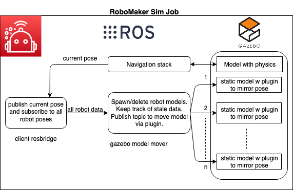

# Robot fleet simulation using concurrent gazebo instances

robot_fleet rospackage within this repo enables co-ordination between multiple gazebo instances to simulate a fleet of robots. We can compound this further by having multiple robots within same simulation as mentioned [here](https://answers.ros.org/question/41433/multiple-robots-simulation-and-navigation/). However, this current version expects a single robot with physics in each simulation, and uses rosbridge server/clients to communicate between the simulation instances.

**Requirements**
* [ROS Melodic](http://wiki.ros.org/melodic) - other versions have not been tested.
* [Colcon](https://colcon.readthedocs.io) - optional. Tested on colcon. catkin confirmed working on melodic only.
* [Gazebo9](http://gazebosim.org/blog/gazebo9) - Gazebo simulator.

**Usage**

* clone this repository in your workspace
* cd robot-fleet-sample-application
* ./setup/ros_setup.bash. This file takes care of
   * new rosdep definition for - roslibpy
   * rosdep update
   * rosws update - that pulls in husky and aws-robomaker-small-warehouse-world repositories
   * Applies minor patches to both the above repos
   * rosdep install -y —from-path <path_of_repos>
   * colcon build; source install/setup.bash
   * colcon bundle
* There are 6 env variables that need to be set for the launch to work correct. They are as follows
    * export ROBOT_NAME=server  # unique robot name
    * export ROSBRIDGE_STATE=SERVER  # SERVER or CLIENT
    * export ROSBRIDGE_IP=localhost  # localhost for SERVER. IP of rosbridge for CLIENT
    * export START_X=0  # start location of robot
    * export START_Y=0
    * export START_YAW=0
    * export HUSKY_REALSENSE_ENABLED=true
    * export HUSKY_LMS1XX_ENABLED=true
    * export USE_CUSTOM_MOVE_OBJECT_GAZEBO_PLUGIN=false  # set to true if you use custom plugin to move robot. False uses regular gazebo rostopics

* roslaunch robot_fleet robot_fleet_rosbridge.launch

**How it works**

* One gazebo instance acts as rosbridge_server and others as rosbridge clients
* We use rosbridge to pass current position information of robots in all gazebo instances
* For all other gazebo instances, we dynamically create and remove static robot models that represent the robot running its actual environment. We use gazebo plugin to move the static model in sync with its actual position information that we gather from rosbridge
* With RoboMaker, its easy to spin up the simulation with ROSBRIGE_SERVER, wait for its IP and pass that along for rest of CLIENT robots.

**Files of interest in the repo**

All core files pertaining to robot fleet are in _*robot_fleet*_ rospackage

* scripts/gazebo_model_mover.py
* scripts/client_rosbridge.py
* src/move_object.cc

**Architecture**

**Roadmap**

* Provide lamda function that sets up entire fleet with one single call.
* Provide cloudformation and other ways to setup the stack on AWS.

**Known issues**

Currently this package does not perform time synchronization, and simulation update lockstep between gazebo instances.

## Security

See [CONTRIBUTING](CONTRIBUTING.md#security-issue-notifications) for more information.

## License

This library is licensed under the MIT-0 License. See the LICENSE file.

