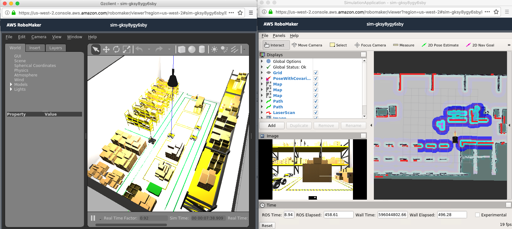

# Robot fleet simulation using concurrent gazebo instances

robot_fleet rospackage within this repo enables co-ordination between multiple [gazebo](http://gazebosim.org/tutorials?tut=ros_overview) instances to simulate a fleet of robots. We can compound this further by having multiple robots within same simulation as mentioned [here](https://answers.ros.org/question/41433/multiple-robots-simulation-and-navigation/). However, this current version expects a single robot with physics in each simulation, and uses [rosbridge](http://wiki.ros.org/rosbridge_suite) server/clients to communicate between the simulation instances.

**Requirements**
* [ROS Melodic](http://wiki.ros.org/melodic) - Other ROS versions have not been tested.
* [Colcon](https://colcon.readthedocs.io) - Tested on colcon. catkin confirmed working on melodic only.
* [Gazebo9](http://gazebosim.org/blog/gazebo9) - Gazebo simulator.
* [Colcon bundle](https://github.com/colcon/colcon-bundle) - Enables packaging the application for running on RoboMaker.
* [boto3](https://docs.aws.amazon.com/cli/latest/userguide/cli-chap-install.html) - AWS SDK for Python
* [awscli](https://docs.aws.amazon.com/cli/latest/userguide/cli-chap-install.html) - AWS CLI setup on local machine with appropriate [credentials](https://docs.aws.amazon.com/cli/latest/userguide/cli-chap-configure.html)

**Usage**

```
git clone https://github.com/aws-samples/multi-robot-fleet-sample-application.git
cd robot-fleet-sample-application
./setup/ros_setup.bash
```

Running this file performs
   * new rosdep definition for - roslibpy
   * rosdep update
   * rosws update - that pulls in husky and aws-robomaker-small-warehouse-world repositories
   * Applies minor patches to both the above repos
   * rosdep install -y —from-path <path_of_repos>
   * colcon build; source install/setup.bash
   * colcon bundle

Set the appropriate environement variables required for the application
```
export ROBOT_NAME=server  # unique robot name
export ROSBRIDGE_STATE=SERVER  # SERVER or CLIENT
export ROSBRIDGE_IP=localhost  # localhost for SERVER. IP of rosbridge for CLIENT
export START_X=0  # start location of robot
export START_Y=0
export START_YAW=0
export HUSKY_REALSENSE_ENABLED=true
export HUSKY_LMS1XX_ENABLED=true
export USE_CUSTOM_MOVE_OBJECT_GAZEBO_PLUGIN=true  # set to true if you use custom plugin to move robot. False uses regular gazebo rostopics
```

Setup multi robot simulation on your AWS account, run the following command **AFTER** running the above commands
```
./setup/aws_setup_sample.bash
```

To see the application running on your local machine, run the following command.
```
source simulation_ws/install/setup.bash
roslaunch robot_fleet robot_fleet_rosbridge.launch gui:=true
```

Note: this architecture assumes you run one gazebo application per instance

Running this file performs

   * Deploying the cloudformation stack to setup the AWS environment
   * Creates and uploads the bundle file to AWS
   * Kicks off a lambda function to start the multi-robot-fleet on AWS

The follwing is the setup on AWS RoboMaker



**How it works**

* One gazebo instance acts as rosbridge_server and others as rosbridge clients
* We use rosbridge to pass current position information of robots in all gazebo instances
* For all other gazebo instances, we dynamically create and remove static robot models that represent the robot running its actual environment. We use gazebo plugin to move the static model in sync with its actual position information that we gather from rosbridge
* With RoboMaker, its easy to spin up the simulation with ROSBRIGE_SERVER, wait for its IP and pass that along for rest of CLIENT robots.


**Architecture**


**Roadmap**

* Provide lamda function that sets up entire fleet with one single call.
* Provide cloudformation and other ways to setup the stack on AWS.

**Known issues**

This package does not perform time synchronization, and simulation update lockstep between gazebo instances. Best results have been seen with homogeneous software stacks running on the gazebo instances.

## Security

See [CONTRIBUTING](CONTRIBUTING.md#security-issue-notifications) for more information.

## License

This library is licensed under the MIT-0 License. See the LICENSE file.

