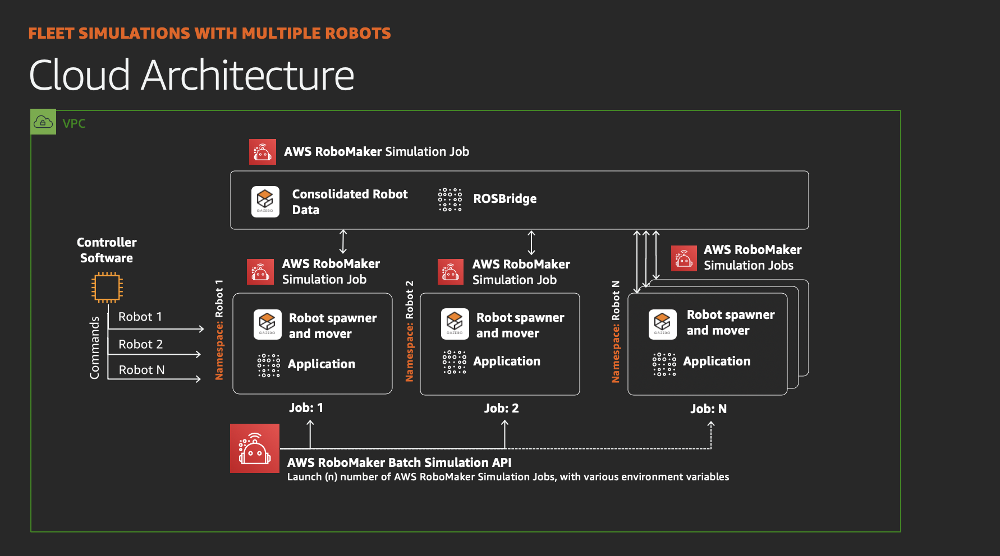

# Multi-robot Fleet Simulation Launcher

This SAM application will launch a fleet simulation on AWS RoboMaker. 



The following attributes will be created on deployment:

A nested base cloudformation stack (base_template.yml) with the following resources:
- **VPC:** A reference to the created VPC
- **Default Security Group:** The default security group created with the VPC
- **Public Subnet 1:** A reference to the public subnet in the 1st Availability Zone
- **Public Subnet 2:** A reference to the public subnet in the 2nd Availability Zone
- **S3 Bucket:** The S3 bucket used to store your AWS RoboMaker assets.
- **Simulation Role:** The IAM role that the simulation application will use to access AWS resources.
- **Simulation Application:** A RoboMaker simulation application created on your behalf. 

The main stack with the serverless app (lambda function, template.yml): 
- **Launcher Lambda Function:** A Lambda function that will launch the set of simulations. 
- **Launcher Lambda Function Role:** An IAM role to use with the lambda function. 

## Deployment

To deploy the SAM application you will first need an S3 bucket. 

```
aws s3 mb s3://<MY_BUCKET_NAME>
```

Then, you can run the SAM build, package and deploy commands from this directory:
```
sam build --use-container -m ./requirements.txt
sam package --output-template-file package.yml --s3-bucket <YOUR_BUCKET>
sam deploy --template-file package.yml --stack-name multirobotstack --capabilities CAPABILITY_NAMED_IAM --s3-bucket <YOUR_BUCKET>
```

## Running

Once the lambda function is deployed, you can send the following event.json structure to launch simulations:

Here is the example JSON:
```
{
    "robots": [
        {
            "name": "robot1",
            "environmentVariables": {
                "START_X": "2",
                "START_Y": "2",
                "START_YAW": "3.143",
                "HUSKY_REALSENSE_ENABLED": "true",
                "HUSKY_LMS1XX_ENABLED": "true",
                "USE_CUSTOM_MOVE_OBJECT_GAZEBO_PLUGIN":"true"
            },
            "packageName": "robot_fleet",
            "launchFile": "robot_fleet_rosbridge.launch"
        }
        ...
    ],
    "server": {
        "name": "SERVER",
        "environmentVariables": {
            "START_X": "0",
            "START_Y": "0",
            "START_YAW": "0",
            "HUSKY_REALSENSE_ENABLED": "true",
            "HUSKY_LMS1XX_ENABLED": "true",
            "USE_CUSTOM_MOVE_OBJECT_GAZEBO_PLUGIN":"true"
        },
        "packageName": "robot_fleet",
        "launchFile": "robot_fleet_rosbridge.launch"
      }
  }
  ```

There are a group of optional attributes you can set if a ROSBridge server is already running or you want to customize the application details.
```
  "serverIP": "<ALREADY_RUNNING_ROSBRIDGE_SERVER>",
  "simulationJobParams": {
      "vpcConfig": {
          "subnets": [],
          "securityGroups": []
      },
      "iamRole": "<PRECREATED_IAM_ROLE>",
      "outputLocation": {
          "s3Bucket": "",
          "s3Key": ""
      }
  },
  "simulationApplicationArn": "<PRECREATED_SIMULATION_APPLICATION>"
```

## Tearing Down

To remove the stack, simply log into AWS and open Cloudformation, find the main stack and press **Delete Stack**.


## Security

See [CONTRIBUTING](../../CONTRIBUTING.md#security-issue-notifications) for more information.

## License

This library is licensed under the MIT-0 License. See the LICENSE file.

